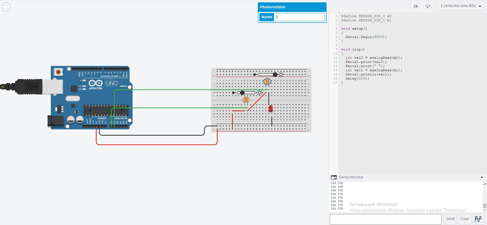

# Носитель сигнала

> Проверьте две гипотезы относительно носителя сигнала для микроконтроллера:
> 1. Носителем сигнала является ток (изменения силы тока влияет на показания, считываемые контроллером)
> 2. Носителем сигнала является напряжение (изменения напряжения влияет на показания, считываемые контроллером)

## Параллельное соединение

При параллельном соединении, при разном уровне освещённости у разных фоторезисторов, их показатели разные.

## Последовательное соединение

При последовательном соединении, при разном уровне освещённости у разных фоторезисторов, их показатели равны.

## Вывод
### Формулы силы тока
- При параллельном соединении
$I = I_1 + I_2$
- При последовательном соединении
$I = I_1 = I_2$
### Формулы напряжения
- При параллельном соединении
$U = U_1 = U_2$
- При последовательном соединении
$U = U_1 + U_2$

Исходя из этого, мы можем сделать вывод, что носитель сигнала - **ток**
